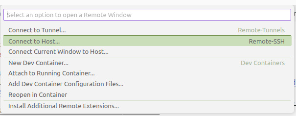
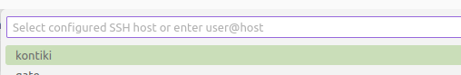

## Połączenie z serwerem za pomocą Visual Studio Code   

1) Program Visual Studio Code można pobrać [stąd](https://code.visualstudio.com/Download). Dalsze informacje o instalacji oraz możliwościach programu można znaleźć [tutaj](https://code.visualstudio.com/docs/setup/setup-overview).  
2) Praca na serwerze wymaga dodatkowo instalacji dodatku `.ssh`. Instrukcje: https://marketplace.visualstudio.com/items?itemName=ms-vscode-remote.remote-ssh.  
3) Pierwsze połączenie:  
   - Należy otworzyć VS Code, po czym wybrać  ikonkę *"Open a Remote Window"* w lewym dolnym  rogu:  
     
   - u góry ekranu pojawi się okno dialogowe, należy wybrać opcję *"Connect to Host..."*:  
      
   - W kolejnym kroku należy wybrać opcję *"Configure Remote Hosts..."*  
  	  
	po czym otworzyć plik konfiguracyjny ssh (pierwszy z listy). Dla systemu operacyjnego Linux/MAC będzie to zazwyczaj `~/.ssh/config` dla systemu Windows `C:\Users\user_lok_komp\.ssh\config`: 
	  
   - W edytorze otworzy sie plik konfiguracyjny, proszę w nim wpisać: 
     ```bash
	 Host kontiki
       HostName 149.156.165.148
       User user174 
	 ```	  
	 Pierwsza linia zawiera nazwę serwera - to dowolna nazwa podana przez użytkownika, która ma jednoznacznie identyfikować serwer. W drugiej linii wpisane jest IP serwera, w kolejnej nazwa konta użytkownika na serwerze. Uwaga: wcięcie jest tu ważne!   
	 Jeśli na danym komputerze pracuje kilka osób (co może się zdarzyć w pracowni), to dla każdej z nich należy stworzyć osobny wpis w pliku konfiguracyjnym:  
	 ```bash
	 Host kontiki-student1
        HostName 149.156.165.148
       User user174 

     Host kontiki-student2
       HostName 149.156.165.148
       User user180
	 ```   
	 Podobnie do pliku można dodawać kolejne serwery. 
     Zmiany w pliku konfiguracyjnym zatwierdzamy przez naciśnięcie Ctrl+s.

   - Po zapisaniu zmian powtarzamy poprzednie kroki: *"Open a Remote Window"* => *"Connect to Host..."*, po czym wybieramy serwer z listy:  
	  
	Program poprosi o podanie hasła - proszę je wpisać i zatwierdzić za pomoca `Enter`.  
    Po połączeniu zmieni się wygląd ikonki w lewym dolnym rogu (wpisana nazwa serwera).  
4) Kolejne sesje - logowanie będzie przebiegać tak, jak w ostatnim podpunkcie punktu trzeciego.  
5) Praca (kilka podpowiedzi):
   - otwarcie terminala: na górnym pasku narzędzi należy wybrać *Terminal* => *New Terminal*
   - można mieć otwartych kilka okien terminala na raz - ikonki w prawym górnym rogu terminala:     
      

   - Można mieć podgląd na listę plików/katalogów obecnych na serwerze poprzez otworzenie katalogu roboczego: *File* => *Open Folder...* (wpisać ścieżkę, lub wybrać podany domyślnie katalog domowy użytkownika). Widok listy plików (eksploratora) otwieramy z lewego paska menu:    
       
      
      Na pasku tym znajdują się też ikonki pozwalające na instalowanie dodatków, debagowanie, obsługę git i inne.  
    - Nowe pliki i katalogi można tworzyć wykorzystując ikonki w  prawym górnym rogu okna eksplorera: 
        

      Można także korzystać z wiersza poleceń w terminalu (`mkdir`, `touch`).  
   - Zmiany w edytowanych plikach mozna zapisać poprzez naciśniecie `Ctrl+s`.
   - Gdy pracujemy na własnym komputerze warto ustawić sobie dostęp do serwera przez klucze ssh (zmniejszy to sznse na zablokowanie konta przez pomyłkowe wpisanie niodpowiedniego hasła). Procedura opisana jest [tutaj](./ssh-keys.md).  


 


