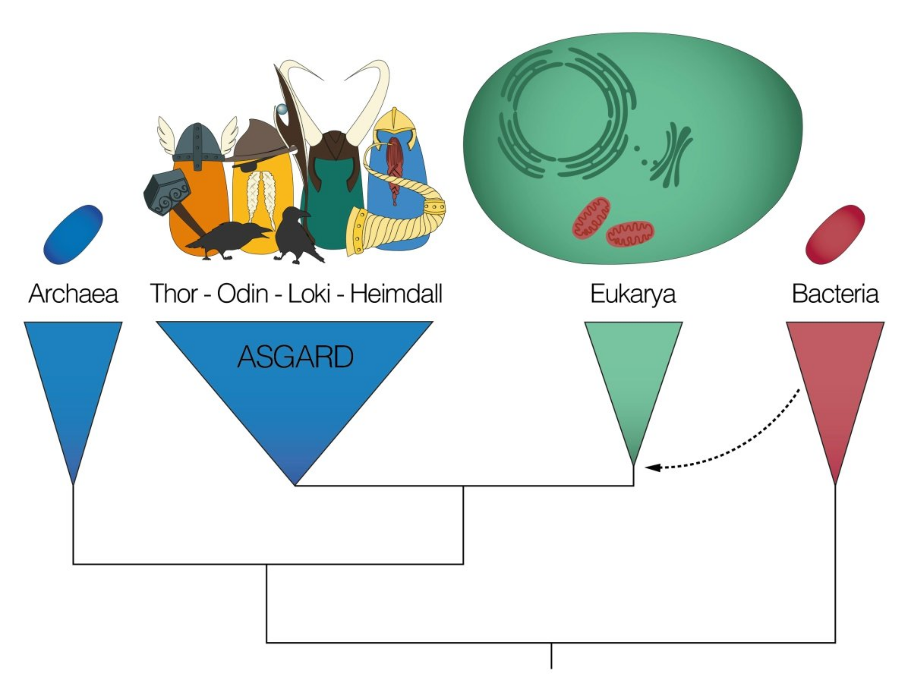

## Blast  

### Zadanie1  
Proszę zapoznać się z artykułem
 [*Complex archaea that bridge the gap between prokaryotes and eukaryotes*](https://www.ncbi.nlm.nih.gov/pmc/articles/PMC4444528/) 
 i na jego podstawie, krótko wyjaśnić, dlaczego organizmy podobne do *Lokiarchaeota* mogły być przodkiem komórek eukariotycznych. Proszę też 
wypisać, jakie grupy białek uważane są za białka ESP (*ang. eukaryotic signature proteins*), czyli białka 
występujące wyłącznie w komórkach eukariotycznych. Więcej na ten temat można znaleźć w pracy
 [*The origin of the eukaryotic cell: A genomic investigation*](https://www.ncbi.nlm.nih.gov/pmc/articles/PMC122206/). Białka z jakich grup ESP znaleziono u *Lokiarchaeota*?  
***
***

### Zadanie2  
#### Wyszukiwanie genów w sekwencji genomowej  
Proszę przeczytać opis dotyczący genomu
 [Lokiarchaeum sp. GC14_75](https://ftp.ncbi.nlm.nih.gov/genomes/genbank/archaea/Candidatus_Lokiarchaeum_sp._GC14_75/latest_assembly_versions/GCA_000986845.1_ASM98684v1/GCA_000986845.1_ASM98684v1_assembly_stats.txt) 
 i podać:  
* Jaka jest całkowita wielkość tego genomu  
* Na ile kontigów jest on podzielony  
* Proszę wyjasnić znaczenie statystyk L-50 i N-50. Jakie są ich wartości dla analizowanego genomu?

Proszę pobrać na serwer sekwencję genomową Lokiarchaeum sp. GC14_75,   
```bash
wget -O lokiarchaeum.fna.gz "https://ftp.ncbi.nlm.nih.gov/genomes/genbank/archaea/Candidatus_Lokiarchaeum_sp._GC14_75/latest_assembly_versions/GCA_000986845.1_ASM98684v1/GCA_000986845.1_ASM98684v1_genomic.fna.gz"
```
po czym użyć programu **prodigal**, aby wyszukać w genomie *Lokiarchaeum* geny kodujące białka. 
Informacja, jak używać tego programu wyświetla się po wpisaniu w terminalu `prodigal -h`. 
 Więcej o zasadzie działania programu znajdą państwo w artykule [*Prodigal: prokaryotic gene recognition and translation initiation site identification*](https://www.ncbi.nlm.nih.gov/pmc/articles/PMC2848648/).
    
 Proszę uzyskać plik fasta z sekwencjami aminokwasowymi wszystkich potencjalnych białek
  Lokiarcheum (**loki-proteins.fa**) - będzie potrzebny do następnego zadania.
 Dodatkowo proszę o wytworzenie listy wszystkich zidentyfikowanych genów, lista powinna być zapisana w formacie gff (**loki-features.gff**).   
 Uwaga, program prodigal oczekuje rozpakowanego pliku z genomem. Aby niepotrzebnie nie śmiecić na dysku, proszę uruchomić
  program bez rozpakowywania sekwencji referencyjnej, używając potoku:  
 ```bash
zcat lokiarchaeum.fna.gz | prodigal -a loki-proteins.fa -f gff -o loki-features.gff
```  
Proszę zastanowić się i przedyskutować użycie dodatkowych argumentów: *-g*, *-p* oraz *-n* (i ewentualnie dodać je do powyższego polecenia).
 Tutaj znajdują się  informacje o rodzajach tablic kodu genetycznego [link](https://www.ncbi.nlm.nih.gov/Taxonomy/Utils/wprintgc.cgi)   
 
 Proszę powrócić na chwilę do artykułu i wyszukać nazwy programów, których można użyć, aby wyszukać w sekwencji genomowej położenie genów
  kodujących tRNA oraz rRNA.   
  Proszę także obejrzeć wynikowy plik **loki-features.gff** i podać:  
  * Ile genów wyszukał program (można policzyć linie bez znaku `#` lub linie z tekstem `CDS` - program `grep`). 
  * Dla ilu z nich prawdopodobieństwo, że są to rzeczywiste geny jest wyższe niż 0.95 (*conf*) - 
  (program `grep` , `awk` - lub inny wymyślony przez siebie sposób).   
  
  Tutaj znajdują się informacje dotyczące
   wynikowych statystyk programu [link](https://github.com/hyattpd/prodigal/wiki/understanding-the-prodigal-output)  
 
 ***
 ***
  
 ### Zadanie3
 #### Wyszukiwanie genów homologicznych  
 Aby dowiedzieć się, jaka jest funkacja białek zidentyfikowanych w poprzednim zadaniu wykorzystają państwo aplikację **blastp** 
 (wchodzącą w skład programu [BLAST+](https://bmcbioinformatics.biomedcentral.com/articles/10.1186/1471-2105-10-421)). Dodatkowo
 wykorzystają państwo blastp, aby sprawdzić, czy rzeczywiście część białek *Lokiarchaeum* jest 
 bardziej podobna do białek eukariotycznych, niż bakteryjnych oraz do identyfikacji białek ESP.   
  
 Aplikacja **blastp** porównuje zadane sekwencje aminokwasowe do sekwencji białek zdeponowanych w bazach danych. W ten sposób można dla 
 białek o nieznanej funkcji wyszukać białka najbardziej do nich podobne (najbliższe ewolucyjnie) i na tej zasadzie 
 wnioskować o ich roli.  
 W tym ćwiczeniu przeszukają państwo jedną z udostępnionych przez NCBI 
 (*ang. National Center for Biotechnology Information*) baz danych: (**pdbaa**). Baza ta zawiera sekwencje wszystkich białek 
 zdeponowanych w bazie [PDB](https://www.rcsb.org/) (*ang. protein Data Base*) i została wybrana tylko dlatego, że jest stosunkowo nieduża.
 Po wpisaniu w terminalu `update_blastdb.pl --showall` otrzymają państwo listę wszystkich dostępnych baz danych.
  Która (które) z nich byłyby odpowiednie dla celów ćwiczenia, tj. dla programu **blastp**? Proszę uzasadnić.   
Poproszę też państwa, aby przeszukać bazę **pdbaa** z wyłączeniem gatunków z grupy *Archaea*. W przeciwnym wypadku, 
otrzymaliby państwo prawie wyłacznie homologii z tej grupy. Od czasu scharakteryzowania *Lokiarchaeum* odkryto wiele podobnych *Archaea* - 
co dobrze podsumowuje załączona rycina . Sekwencje ich genomów są już zdeponowanane w bazach danych wykorzystywanych przez blast.    
***   
 
 Etapy analizy:  
 1. Uzyskanie pliku zawierającego ID wszystkich znanych gatunków z grupy *Archaea*.   
 Taka lista będzie potrzebna, aby wykluczyć sekwencje białek tych gatunków z przeszukiwanej bazy danych. Cała procedura jest szczegółowo 
 opisana [tutaj](https://www.ncbi.nlm.nih.gov/books/NBK546209/). Listę proszę zapisać do pliku:
    ```bash
    ## uzyskanie numeru ID taksonu (taxid) o zadanej nazwie, tutaj dla Archaea
    ## get_species_taxids.sh -n Archaea
    ## Uwaga: zainstalowana wersja skryptu get_species_taxids.sh ma mały "bug" i nie działa poprawnie.
    ## Niezbyt elegancko "załataną" wersję skryptu znajdą Państwo w katalogu /dane proszę jej użyć:
    /dane/get_species_taxids_fixed.sh -n Archaea
          
    ## zapisanie do pliku archaea-taxid-list.txt ID wszystkich gatunków wchodzących w skład Archaea
    ## w poniższyej komendzie za 'taxid' należy podstawić ID grupy Archaea - ta część działa poprawnie w wersji zainstalowanej 
    get_species_taxids.sh -t taxid > archaea-taxid-list.txt  
    
    ```

 2. Przeszukanie bazy danych używając pliku z sekwencjami białek *Lokiarchaeum*:
     ```bash
    ## pomoc i szczegółowy opis argumentów 
    blastp -help 
    
    ## wyszukanie homologów białek Lokiarchaeum
     export BLASTDB=/usr/local/share
     blastp -db pdbaa \
            -query loki-proteins.fa \
            -evalue 0.02 \
            -negative_taxidlist archaea-taxid-list.txt \
            -outfmt  "7 delim=; qseqid sseqid sacc evalue staxid ssciname scomname sblastname sskingdom stitle" \
            -out loki-output.txt  \
            -subject_besthit \
            -max_target_seqs 1
                    
       ```
    Przed uruchomieniem analizy proszę przestudiować pomoc i rozszyfrować znaczenie poszczególnych argumentów - 
    niektóre z nich nie są polecane przez twórców 
    programu blastp, ale pomogą ograniczyć wielkość wynikowego pliku. `/usr/local/share/pdbaa` to położenie bazy danych. 
    Samo przeszukiwanie potrwa dość długo i dobrze go uruchomić w programie [screen](https://github.com/genomika-2020/genomika/blob/master/README.md#program-screen)
    
3. Proszę przeszukać wynikowy plik i odpowiedzieć na pytania:  
 * Dla ilu białek *Lokiarchaeum* udało się zidentyfikować białko homologiczne
   (np. policzyć ile razy w wynikowym pliku pojawia się wyrażenie regularne `'[1-5] hits found'`)  
 * Dla ilu białek nie zidentyfikowano homologa, przy ustawionym poziomie e-value 
  (np. policzyć ile razy w wynikowym pliku pojawia się fraza `'0 hits found'`)
 * Ile razy znaleziony "najlepszy homolog" należy do bakterii, a ile razy do eukariontów?  
 * Czy pośród zidentyfikowanych białek są białka należące do grupy ESP?     
 
 ***
 ***
 Proszę pamiętać, że nie wszyscy naukowcy uważają, że przedstawiona w analizowanej pracy hipoteza pochodzenia
 komórek eukariotycznych jest dostatecznie udowodniona [link](https://journals.plos.org/plosgenetics/article?id=10.1371/journal.pgen.1006810)  
 
 ***
 ***
 [Powrót do strony zajęć](https://github.com/genomika-2020/genomika/blob/master/README.md) 
 
